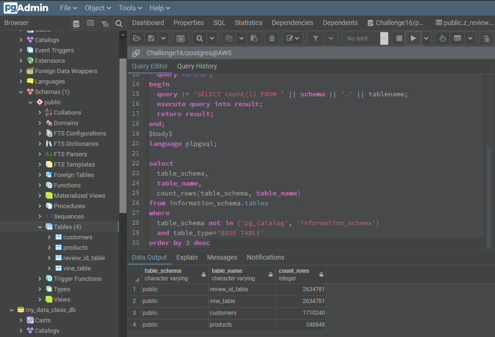

# BigData

This repo I demonstrate abilities learned via the Big Data module from bootcamp.  The final challenge demonstrate using big data dataset (ie. data that is too large to be easily processed locally by a pc), setting up an AWS RDS postgres database, use Google Colab Notebook to perform ETL on a big dataset, then analyze the data outcome and provide an anlysis.  

## Showing data loaded into 4 tables in psql on AWS.  

Link to my ETL and analysis on Google Colab:
https://colab.research.google.com/drive/1tXXY-pN4oxx8wdtSgCtQjGGhhss-glO5?usp=sharing

## Final Analysis:

To summarize our findings about vine paid vs non paid data, we have:

**1. Total count of reviews: 10,779 paid, 2,623,758 non-paid.** 
**2. Total 5 star reviews: 5,557 paid, 1,650,924 non-paid.** 
**3. Average star: 4.30 paid, 4.18 non-paid.** 
**4. Number of helpful votes: 28,568 paid, 4,403,524 non-paid.** 

It appears that our review data suggest a similar trend between the paid versus non-paid at a high level, despite being different in terms of scale or volume.  We can further see that about 80% and 83% of total votes are helpful votes (helpful/total) for paid vs non-paid respectively.  If we filter out "the noise" by only looking at reviews that have 3 or more votes and are considered helpful (by having over 90% as helpful).  Then, we can see the average star rating across reivews as 4.21 and 4.18.  

We can safely conclude that vine reviews are similar to non-paid review  therefore trustworthy.  However, it should be noted that there is a small postitive skew or difference.  As in, paid reviews give slightly higher star rating.  Even by filtering out "the noise", the data between paid vs non-paid are still similar but also positive skewing for the paid reviews.  
